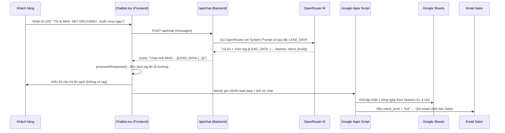

# Tích hợp Lead Capture: Chatbot AI → Google Sheets

## Phân tích dự án hiện tại

Project Next.js có 2 file chính liên quan:

| File | Vai trò |
|------|---------|
| [Chatbot.tsx](file:///e:/CES%20AI%20K1/Web/nang-luong-xanh-nextjs/components/Chatbot.tsx) | Component React xử lý UI chat, gửi tin nhắn, hiển thị kết quả |
| [route.ts](file:///e:/CES%20AI%20K1/Web/nang-luong-xanh-nextjs/app/api/chat/route.ts) | API route gọi OpenRouter (model `glm-4.5-air:free`) với System Prompt |

## Luồng hoạt động tổng thể



---

## ✅ Phiên bản 1 (ĐÃ HOÀN THÀNH)

- [x] System Prompt trích xuất `name`, `phone`, `email`
- [x] Frontend bóc tách tag `||LEAD_DATA:...||` và gửi Google Sheets
- [x] Google Sheets 7 cột, gộp theo Session ID
- [x] Deploy lên Vercel thành công

---

## ✅ Phiên bản 2 — Phân loại khách hàng bằng AI (ĐÃ HOÀN THÀNH CODE)

### Thay đổi Code (đã triển khai)

- [x] **route.ts** — System Prompt trích xuất 5 trường: `name`, `phone`, `email`, `interest`, `intent_level`
- [x] **Chatbot.tsx** — Frontend gửi thêm `interest` + `intent_level` lên Google Apps Script
- [x] Build thành công, không lỗi TypeScript

### Phần BẠN cần làm

#### Bước 1: Thêm 2 cột mới vào Google Sheets

| A | B | C | D | E | F | G | H | I |
|---|---|---|---|---|---|---|---|---|
| Thời gian | Tên | SĐT | Email | Nguồn | Session ID | Lịch sử Chat | **Quan tâm** | **Mức độ** |

#### Bước 2: Cập nhật Code.gs trong Google Apps Script

Xóa hết code cũ, dán code mới bên dưới, **thay `YOUR_SPREADSHEET_ID`** bằng ID Sheets thật và **thay `YOUR_EMAIL`** bằng email nhận cảnh báo:

```javascript
// ============================================================
// FILE: Code.gs — Google Apps Script v2 — Phân loại Lead + Cảnh báo Email
// ============================================================

function doPost(e) {
  try {
    var sheet = SpreadsheetApp.openById('YOUR_SPREADSHEET_ID').getActiveSheet();
    var data = JSON.parse(e.postData.contents);

    var newTime = data.timestamp || new Date().toLocaleString('vi-VN');
    var newName = data.name || '';
    var newPhone = data.phone || '';
    var newEmail = data.email || '';
    var newSource = data.source || '';
    var newSessionId = data.sessionId || '';
    var newHistory = data.chatHistory || '';
    var newInterest = data.interest || '';
    var newIntentLevel = data.intent_level || '';

    var dataRange = sheet.getDataRange();
    var values = dataRange.getValues();
    var rowIndexToUpdate = -1;

    // Tìm kiếm Session ID đã tồn tại chưa
    if (newSessionId) {
      for (var i = values.length - 1; i > 0; i--) {
        var rowSessionId = values[i][5] ? values[i][5].toString().trim() : '';
        if (rowSessionId === newSessionId) {
          rowIndexToUpdate = i + 1;
          break;
        }
      }
    }

    if (rowIndexToUpdate > -1) {
      // CẬP NHẬT GỘP (chỉ ghi đè nếu cũ đang trống)
      var currentRow = values[rowIndexToUpdate - 1];
      if (!currentRow[1] && newName) sheet.getRange(rowIndexToUpdate, 2).setValue(newName);
      if (!currentRow[2] && newPhone) sheet.getRange(rowIndexToUpdate, 3).setValue(newPhone);
      if (!currentRow[3] && newEmail) sheet.getRange(rowIndexToUpdate, 4).setValue(newEmail);

      // Lịch sử chat luôn ghi đè bản mới nhất
      if (newHistory) sheet.getRange(rowIndexToUpdate, 7).setValue(newHistory);

      // Quan tâm & Mức độ: luôn cập nhật bản mới nhất
      if (newInterest) sheet.getRange(rowIndexToUpdate, 8).setValue(newInterest);
      if (newIntentLevel) sheet.getRange(rowIndexToUpdate, 9).setValue(newIntentLevel);

      // Cập nhật thời gian tương tác mới nhất
      sheet.getRange(rowIndexToUpdate, 1).setValue(newTime);
    } else {
      // TẠO DÒNG MỚI
      sheet.appendRow([newTime, newName, newPhone, newEmail, newSource, newSessionId, newHistory, newInterest, newIntentLevel]);
    }

    // 🔥 GỬI EMAIL CẢNH BÁO NẾU KHÁCH "HOT"
    if (newIntentLevel && newIntentLevel.toLowerCase() === 'hot') {
      var salesEmail = 'YOUR_EMAIL'; // ← THAY BẰNG EMAIL CỦA BẠN
      var subject = '🔥 KHÁCH HÀNG NÓNG - CẦN LIÊN HỆ NGAY!';
      var body = '📢 KHÁCH HÀNG NÓNG - CẦN LIÊN HỆ NGAY!\n\n'
        + 'Tên: ' + (newName || 'Chưa rõ') + '\n'
        + 'SĐT: ' + (newPhone || 'Chưa rõ') + '\n'
        + 'Email: ' + (newEmail || 'Chưa rõ') + '\n'
        + 'Quan tâm: ' + (newInterest || 'Chưa rõ') + '\n'
        + 'Thời gian: ' + newTime + '\n'
        + 'Nguồn: ' + (newSource || '') + '\n\n'
        + 'Vui lòng liên hệ khách hàng này trong vòng 30 phút!\n\n'
        + '--- Lịch sử chat ---\n' + (newHistory || 'Không có');

      MailApp.sendEmail(salesEmail, subject, body);
    }

    return ContentService.createTextOutput(JSON.stringify({ status: 'success' })).setMimeType(ContentService.MimeType.JSON);
  } catch (error) {
    return ContentService.createTextOutput(JSON.stringify({ status: 'error', message: error.toString() })).setMimeType(ContentService.MimeType.JSON);
  }
}

function doGet() {
  return ContentService.createTextOutput("API Chatbot Leads v2 đang hoạt động! ✅");
}
```

#### Bước 3: Deploy phiên bản mới

1. Lưu (Ctrl+S)
2. **Deploy** → **Manage deployments** → nhấn ✏️ → chọn **New version** → **Deploy**
3. Copy URL mới (nếu thay đổi), nhắn lại cho mình

---

## Tiêu chí đạt

- [ ] System Prompt hoạt động — AI trích xuất đúng 5 trường
- [ ] Tag ẩn bị xóa sạch trước khi hiển thị cho khách
- [ ] Dữ liệu ghi đúng vào Google Sheets (đủ 9 cột)
- [ ] Cùng Session ID → cập nhật gộp, không tạo dòng mới
- [ ] Khách "hot" → email cảnh báo được gửi đi
